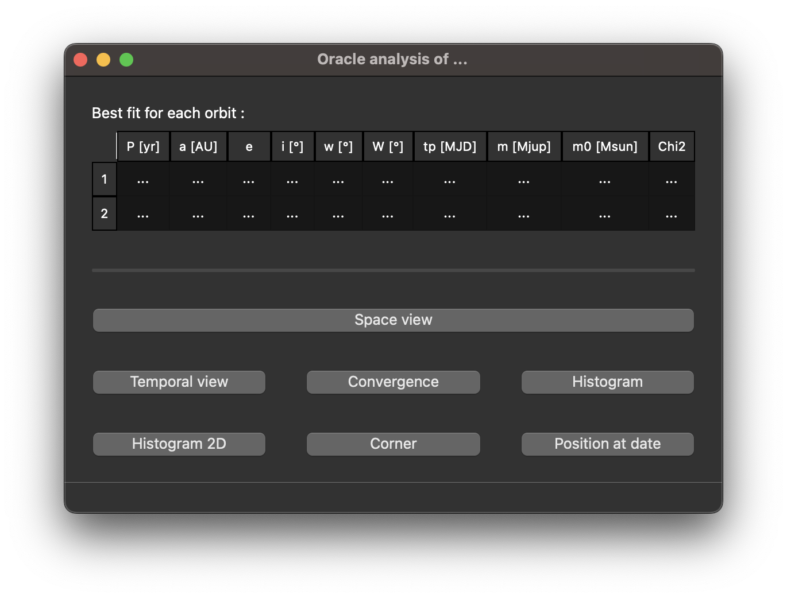

`Oracle` (Hervé Beust & Antoine Lacquement, 2025) is an open-source orbital fitting code based on Markov Chain Monte Carlo (MCMC) methods. It is designed to infer orbital parameters from observational data (high-contrast imaging and radial velocity measurements). The software includes a graphical user interface that facilitates both the setup of simulations and the analysis of their outcomes.

  

# Table of contents

- [Installation on personal computeur](#install_on_computer)

- [Installation on computing server](#install_on_server)

- [Simulation](#simulation)
    - [Choice of integrator](#integrator)
    - [Generation of sub-simulations](#generation)
    - [Launch](#launch)
    - [Continuation](#continuation)
    - [Extraction](#extraction)

- [Analyse](#analyse)
    - [Space view](#space_view)
    - [Radial profile](#radial_profile)
    - [Diagram a=f(e)](#diagram_ae)
    - [Diagram y=f(t)](#diagram_yt)
    - [Diagram y=f(x)](#diagram_yx)
    

  

  

# Installation on personal computer

## Prerequisites

You need python3 and a fortran compiler, as gfortran.

## Create a container

It is recommended that you create a virtual environment. It is an isolated execution environment. It allows the packages used for a project to be isolated, so that there are different versions for each project.

To do this, use the following command: 

`python3 -m venv <environment_path>`

You can now activate the environment: 

`source <environment_path>/bin/activate`

The `python3` command will now refer to the python3 installed in your environment `<environment_path>/bin/python3` and not the one on the system. And the libraries are now installed in the `<environment_path>/lib/` directory.

If you do not choose this option, simply create an usual directory:

`mkdir <environment_path>`

## Download the github directory  

Now that the container is ready, you can download the gihub directory inside:

`cd <environment_path>`

`git clone https://github.com/lacquema/Astroide`

## Install python packages

All the necessary python packages are listed in the `<environment_path>/Astroide/requirements.txt` file. You can install them all:

`pip3 install -r <environment_path>/Astroide/requirements.txt`

## Compile fortran code

If you are using the fortran compiler `gfortran`, you can directly compile all the fortran files:

`cd <environment_path>/Astroide`

`make compile`

Else, edit the `<environment_path>/Astroide/Makefile` file by updating the COMPILF variable. This corresponds to the paths or simply the command for the executables of the fortran compiler installed on your computer. Then, run the commands above. 

  

  

# Installation on computing server

You can import the code from github in the same way as on your personal computer. The difference lies in the installation of the software dependencies. 

On computing servers, the use of modern package managers such as Guix is highly recommended and often mandatory. These tools enable isolated and reproducible management of software dependencies, thus avoiding unintentional changes to the server environment. In addition, Guix avoids unnecessary duplication of packages by storing shared dependencies only once in the server's `/gnu/store`. This considerably reduces the use of storage space. 

Instead of installing packages directly, you configure them to reference the Guix-managed library. All required packages are explicitly listed in the `<environment_path>/Astroide/manifest.scm` file. You can reference them all:

`guix package -m <environment_path>/Astroide/manifest.scm`

Ensure to consult the Guix documentation provided by your server administrators, as specific configurations or permissions might apply.

Note that software dependencies may includes the python packages we need, as well as python3 itself and the fortran compiler `gfortran-toolchain`.

At this point, all that remains is to compile the fortran files in the same way as on a personal computer. 

  

  

# Simulation

You have access to a graphical interface to set up and launch a new simulation. To start the interface, run:

`python3 <environment_path>/Astroide/Interface/Main.py`

Click the `New simulation` button and follow the guided options provided by the interface. The step-by-step process will help you configure all necessary parameters for your simulation.

# Analyse

The interface also provides powerful tools to analyze the results of your simulation.

After clicking the `Analyse` button, use the file browser on the left side of the interface to navigate to and select your simulation output files. You can double-click to open the relevant folder. Once your selections are complete, click `Analyse the simulation` to begin the analysis process.

At the top of the window, you will see a table displaying the orbital parameters for each orbit in your simulation, corresponding to the best-fit solution (i.e., the one with the lowest chi-squared value). This summary provides a quick overview of the most likely orbital configuration based on your data.

The interface offers a comprehensive set of tools for exploring and visualizing your simulation results, each designed to support different aspects of your analysis. For every feature, you can access various options to customize and refine your study according to your specific needs. Descriptions and helpful tooltips appear when you hover over different elements of the interface, making it easier to understand and utilize each function effectively.

  

**...Documentation in progress...**

We are actively working to expand and improve this documentation. More detailed guides, examples, and reference materials will be added soon. If you have questions or need assistance in the meantime, please refer to the [GitHub repository](https://github.com/lacquema/Oracle) and open an issue for support, or send an email to antoine.lacquement@univ-grenoble-alpes.fr.

Thank you for your patience and interest in Oracle!

